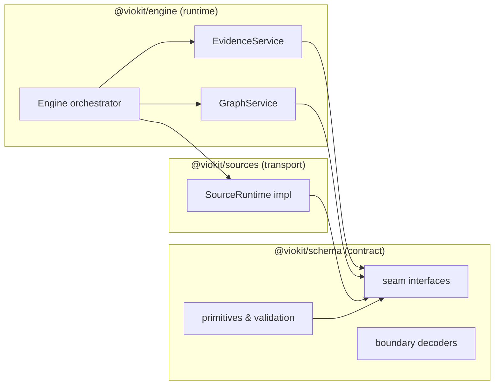
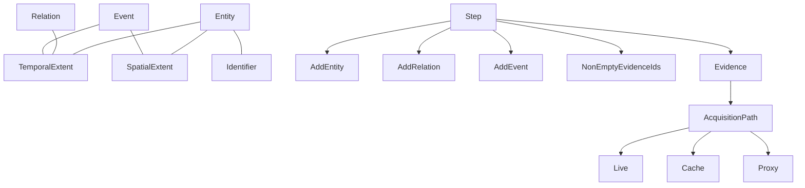
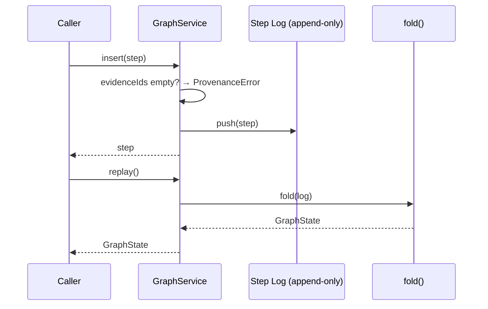
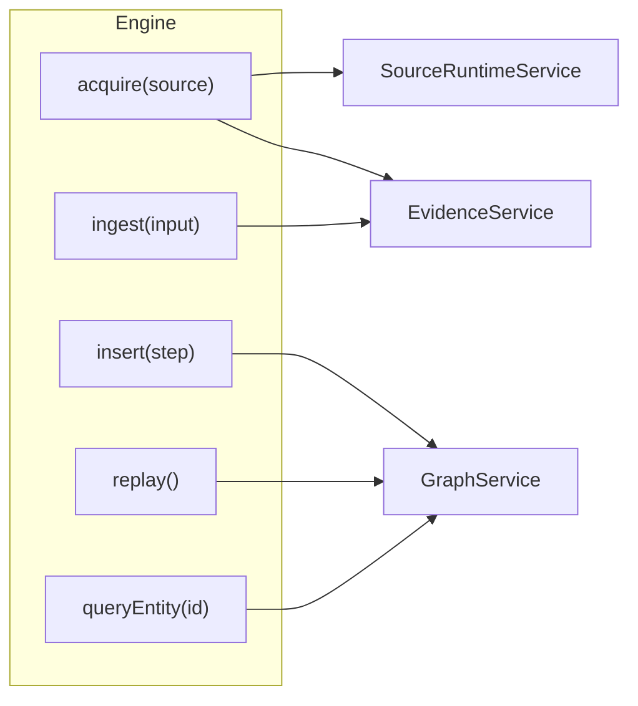
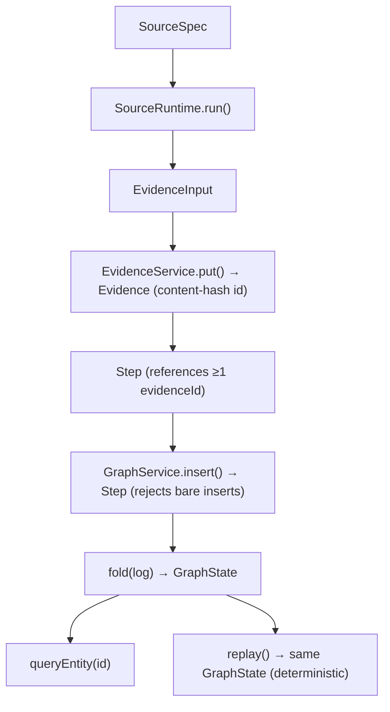

# Viokit — TypeScript Architecture Overview

> High-level explanation and diagrams of the Viokit engine's TypeScript
> architecture, derived from the OpenSpec change `stage-0-spine`, the
> `TDR-001` decision, and the code in `packages/`. Aimed at someone learning
> how the system works.

---

## 1. What Viokit is

Viokit is an **investigation engine**. At a high level it is a pipeline that:

1. **Acquires evidence** from sources (live HTTP fetches, caches, proxies).
2. **Ingests** that evidence immutably.
3. **Builds a graph** of entities, relations, and events, where every node/edge
   is traceable back to the evidence that justifies it.
4. **Queries and replays** that graph deterministically.

The defining trait is **provenance**: nothing enters the graph without evidence,
and nothing in the graph can be silently mutated — the whole investigation is an
append-only event log whose current state is *derived*, never edited in place.

This document focuses on the Stage 0 **spine**: the thinnest end-to-end thread
(`source → evidence → graph → query → replay`) that proves the architecture
before deep capability work.

---

## 2. The three packages (the "three seams")

The codebase is a Bun workspace (`package.json` → `workspaces: [viokit-site, packages/*]`)
with three new packages. Each maps 1:1 to a capability boundary, so later stages
deepen a package rather than restructure the layout.

| Package | Role | Owns |
|---|---|---|
| `@viokit/schema` | **The contract.** Effect Schema primitives + the capability-boundary interface types. The single source of truth for anything that crosses a boundary. | `Entity`, `Relation`, `Event`, `Evidence`, `Step`, `AcquisitionPath`, `EvidenceStore`, `GraphStore`, `SourceRuntime`, validation |
| `@viokit/engine` | **The runtime.** In-memory implementations of every seam + the orchestrating `Engine`. | content-hash evidence store, fold-over-log graph store, replay, orchestration |
| `@viokit/sources` | **The transports.** Real HTTP source realization. | `SourceSpec`, fetching, policy (future stages) |



The dependency direction matters: `engine` and `sources` depend on `schema`,
but `schema` depends on nothing else in the repo. The contract is the stable
center.

---

## 3. The schema contract — `@viokit/schema`

Everything Viokit passes across a boundary is defined as an **Effect Schema**
(`Schema.Class` / `Schema.Struct` / `Schema.TaggedClass`). This gives three things
for free:

- **Decode/encode** — turn unknown wire data into trusted typed values.
- **Validation** — reject bad input at the boundary (invariant I6).
- **A shared language** — the same schema is used by server, CLI, MCP, and (later)
  the browser client, so there is no drift between surfaces.

### 3.1 The primitives

The core primitives model a 4D investigation space: **who/what** (entities),
**relationships** (relations), **happened-when/where** (events + temporal/spatial
extents).

| Schema | Meaning | Key fields |
|---|---|---|
| `Identifier` | an external identifier on an entity | `kind`, `value` |
| `TemporalExtent` | a valid time window | `validFrom ≤ validTo` (cross-field validated, I5) |
| `SpatialExtent` | a location | `lon`, `lat` |
| `Entity` | a person/org/thing | `id`, `kind`, `identifiers`, extents |
| `Relation` | a directed link between entities | `sourceId`, `targetId`, `type` |
| `Event` | something that happened | `entityIds`, `kind`, extents |
| `Evidence` | raw captured bytes | `id`, `bytes`, `contentType`, `observedAt`, `acquisitionPath` |
| `Step` | one graph write with its provenance | `evidenceIds` (≥1), `operation` |
| `AcquisitionPath` | how evidence was obtained | tagged union `live` / `cache` / `proxy` |

Every id (`EntityId`, `RelationId`, …) is a **branded string** — a phantom type
that makes it impossible to pass an `EntityId` where a `StepId` is expected.



### 3.2 The seam interfaces — what "swappable backend" means

The store/network backends are **interfaces** (not concrete classes) defined in
the schema package. This is the key architectural lever: swapping Postgres,
SurrealDB, or Neo4j later is a *backend* change, not an *interface* change.

```ts
// packages/schema/src/seams.ts (abridged)
export interface EvidenceStore {
  put(input: EvidenceInput): Effect<Evidence, EvidenceWriteError>
  get(id: EvidenceId): Effect<Option<Evidence>, EvidenceReadError>
  list(): Effect<readonly Evidence[]>
}

export interface GraphStore {
  insert(step: Step): Effect<Step, ProvenanceError>
  log(): Effect<readonly Step[]>
  replay(): Effect<GraphState>
  queryEntity(id: string): Effect<Option<Entity>>
}

export interface SourceRuntime {
  run(source: SourceSpec): Effect<EvidenceInput>
}
```

Notice every method returns an **`Effect`** — Viokit is fully Effect-native. The
success and error channels are explicit types, so error handling is visible in
the type signature rather than thrown at runtime.

### 3.3 Boundaries never trust input

`packages/schema/src/boundary.ts` exposes decoders that validate at the seam
before anything enters the system:

- `decodeTemporalExtentBoundary` — rejects `validFrom > validTo` (I5).
- `decodeEvidenceBoundary` — schema-conforms the input (I6) **and** rejects
  future-dated evidence by consulting the current clock (`observedAt > now`).
- `decodeGraphStateBoundary` — conforms a graph state read back.

These codify invariant **I5** (temporal validity) and **I6** (schema conformance)
directly in the schema layer, so any caller — engine, CLI, API, MCP — gets the
same validation.

---

## 4. The engine — `@viokit/engine`

The engine is where the abstract seams get concrete, **in-memory**
implementations and where the pipeline is orchestrated.

### 4.1 Content-hash evidence (immutability, I1)

`EvidenceService` implements `EvidenceStore`. Evidence ids are **derived from the
raw bytes at write time** (a deterministic FNV-1a 64-bit hash, `fnv1aHex`):

```ts
// packages/engine/src/evidence.ts (abridged)
const id = fnv1aHex(input.bytes)
const existing = byId.get(id)
if (existing !== undefined) return existing   // identical bytes dedupe
const evidence = Evidence.make({ id, ...input })
byId.set(id, evidence)                        // write-once; never mutated
```

This makes immutability structural (I1):

- identical bytes → identical id → dedupe,
- any byte change → different id → a *new* artifact,
- no code path mutates a stored artifact.

### 4.2 Graph as a fold over an append-only log (I2, I3)

`GraphService` implements `GraphStore`. The crucial idea: **the step log is the
source of truth, and the graph state is derived from it.**

```ts
// packages/engine/src/graph.ts (abridged)
const steps: Step[] = []              // append-only log

const fold = () => {
  // walk every step, apply AddEntity / AddRelation / AddEvent
  // to Maps, then materialize a GraphState
  return GraphState.make({ entities, relations, events })
}
```

Two guarantees fall out:

- **Replay determinism (I3):** replay *is* just re-folding the same log. The
  state is always reproducible.
- **Provenance closure (I2):** `insert` rejects any `Step` whose `evidenceIds` is
  empty — a graph write without evidence never succeeds. The check is enforced at
  the store boundary, so it can't be bypassed.



### 4.3 Orchestration — the `Engine`

`Engine` is a thin facade that wires the services together. It is built with
Effect **layers** (dependency injection), so swapping an in-memory store for a
real database later is just providing a different `Layer`.



```ts
// packages/engine/src/engine.ts (abridged)
export const EngineLayer = Layer.effect(Engine, () =>
  Effect.gen(function* () {
    const evidence = yield* EvidenceService
    const graph = yield* GraphService
    const runtime = yield* SourceRuntimeService
    return {
      acquire: (source) =>
        Effect.gen(function* () {
          const input = yield* runtime.run(source) // fetch + normalize
          return yield* evidence.put(input)         // content-hash + store
        }),
      ingest:  (input) => evidence.put(input),
      insert:  (step) => graph.insert(step),
      log:     () => graph.log(),
      queryEntity: (id) => graph.queryEntity(id),
      replay:  () => graph.replay()
    }
  })
).pipe(
  Layer.provide(EvidenceLayer),
  Layer.provide(GraphLayer)
)
```

---

## 5. The sources package — `@viokit/sources`

`packages/sources` realizes the `SourceRuntime` seam with real network behavior.
Its contract with the rest of the system is deliberately narrow: given a
`SourceSpec`, produce an `EvidenceInput` with an `AcquisitionPath`.


This is where invariants **I4/I9/I10** (policy isolation and cache transparency)
will live in later stages: fetch, retry, backoff, rate-limit, and cache/proxy
selection belong *here*, never in transforms or the UI. In Stage 0 the HTTP
dependency is injectable/mockable so CI stays deterministic.

> Note: at the time of writing, `packages/sources/src` is scaffolded but not yet
> implemented — the seam interface exists, the concrete source is a Stage 0 task.

---

## 6. The end-to-end spine (putting it together)

The Stage 0 proof runs one full thread: **source → evidence → graph → query →
replay**.



### Why the state is a *derived fold*, not a database

The single most important idea in the architecture is **D4: the pipeline is a
fold over the step log**. The graph database (later) is a *materialized cache* of
the log — not the source of truth. This makes:

- **Replay free** — just re-fold the log (I3),
- **Immutability structural** — the log is append-only (I1/I3),
- **Offline determinism possible** — same log + same inputs ⇒ same graph (I11,
  later stage).

---

## 7. The invariants the code enforces

The engine's guards are keyed to the invariant contract. Stage 0 exercises the
core set:

| Invariant | Meaning | Where enforced |
|---|---|---|
| **I1** | Evidence immutability, content-hash = identity | `EvidenceService` / `fnv1aHex` |
| **I2** | No graph write without a Step → evidence | `GraphService.insert` rejects empty `evidenceIds` |
| **I3** | Append-only log; replay deterministic | `GraphService` fold over `steps[]` |
| **I5** | Temporal validity, no future evidence | `TemporalExtent.check`, `decodeEvidenceBoundary` |
| **I6** | Schema conformance at every boundary | `Schema.decodeUnknownEffect` decoders |
| **I9** | Acquisition path recorded | `Evidence.acquisitionPath` required |

The remaining invariants (I4, I7, I8, I10–I12) are stubbed out by design — they
belong to later stages and the interfaces are already shaped to accept them.

---

## 8. Key architectural decisions (from `design.md`)

- **D1 — One package per seam.** `schema` / `engine` / `sources` map to
  capability boundaries; later stages deepen rather than restructure.
- **D2 — In-memory implementations behind interfaces.** Backends are swappable
  without touching interfaces.
- **D3 — Content hash = evidence id.** Immutability enforced at the type level.
- **D4 — Pipeline is a fold over the step log.** Replay is just re-folding.
- **D5 — Bun + Effect v4.** Node stays a drop-in via the Effect platform.
- **D6 — One real HTTP source.** Proves the source seam end-to-end.

The toolchain pins `effect@4.0.0-beta.103` and `typescript@7.0.2` across all
three packages, shared through the workspace.

---

## 9. Mental model — one paragraph

> Viokit treats an investigation as a **tamper-evident event log**. Sources feed
> raw evidence; evidence is stored by the hash of its bytes (so it can't change);
> every graph change is recorded as a `Step` that *must* cite that evidence; and
> the graph you see is simply the log folded into shape. Backends are
> interchangeable because everything talks to typed interfaces, and every
> boundary validates through one shared Effect-Schema contract. Stage 0 proves
> this loop in memory with one HTTP source — later stages swap in real databases,
> transforms, UI, and domain packs without reworking the seams.
